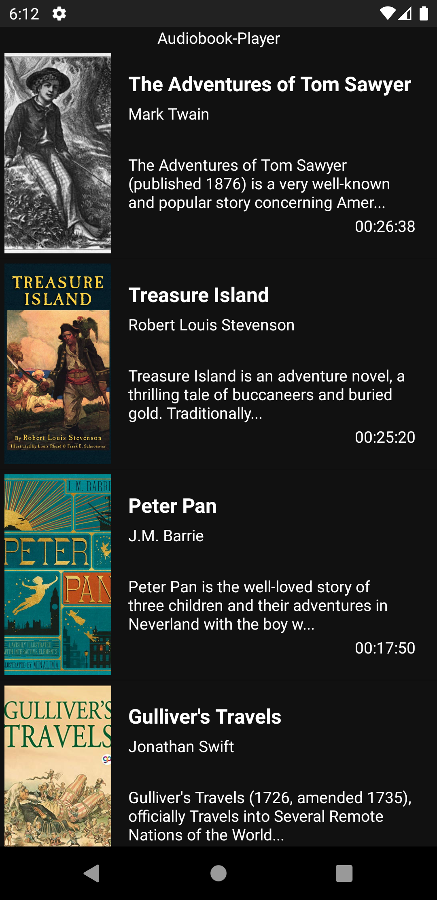
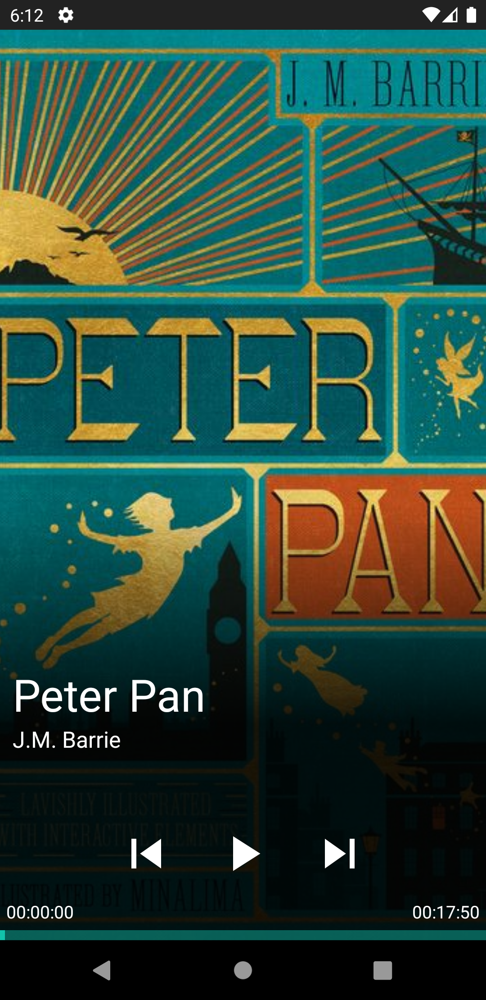

# U12 | AudiobookPlayer

## Aufgabe

Das Ziel dieser Aufgabe ist die Implementierung einer App zum Abspielen von Hörbüchern. Dazu verwenden Sie die [*MediaPlayer*-Klasse](https://developer.android.com/reference/android/media/MediaPlayer) des Android-Frameworks, die unter anderem dazu genutzt werden kann, Audioquellen aus dem Internet zu streamen. Im Rahmen dieser Aufgabe wiederholen sie außerdem nochmal die Verwendung der [*Service*](https://developer.android.com/guide/components/services)-Funktionalität und *RecyclerViews*. Für letzteres werden Sie die [Glide-Library](https://github.com/bumptech/glide) verwenden, um `ImageViews` mit Bildern aus dem Internet zu befüllen.

**Hinweis**: Bei dieser Aufgabe handelt es sich um die letzte innerhalb des Kurses. Die Aufgabe ist entsprechend umfangreicher als bisherige und verwendet einige Bibliotheken, die wir im Laufe des Kurses kennen gelernt haben.

**Hinweis2**: Die lizenzfreien Audioaufnahmen der gewählten Bücher stammen von der Seite [Librivox](https://librivox.org/). Es handelt sich nur um Ausschnitte aus den jeweiligen Werken.

### Vorgaben

Das Layout für die Activities der Anwendung sind bereits vorgegeben. In der `MainActivity` befindet sich eine `RecyclerView` zur Auflistung der verfügbaren Hörbücher. Das Design für die einzelnen Items der Liste haben wir in der Datei `audiobook_item.xml` für Sie erstellt. Die Anbindung der `RecyclerView` einen passenden `CustomAdapter` müssen Sie selbst übernehmen. Eine dafür notwendige Repräsentation der Hörbücher finden Sie in der `AudioBook`-Klasse. Die Daten von fünf exemplarischen Hörbüchern stellen wir Ihnen über die URL `https://audiobook.software-engineering.education/audiobookdata.json` zur Verfügung - ein Zugriff darauf erfolgt wie in [U07-MensaApp](https://android-regensburg.github.io/AssignmentViewer/index.html#Android-Regensburg/U07-MensaApp) mit Hilfe des `Volley`-Frameworks. Diese Funktionalität ist bereits in einer `APIRequest`-Klasse implementiert - sie müssen lediglich die Antwort des Servers an die Methode `fromJSONString` der `AudioBook`-Klasse übergeben, um eine Liste selbiger zu erhalten. Die Strukturierung der Daten erfolgt innerhalb der Methode über die `GSON`-Library.

In der `AudioPlayerActivity` finden Sie Textfelder für die Meta-Informationen eines ausgewählten Hörbuchs. Außerdem sind dort Buttons zur Steuerung der Wiedergabe und eine `Seekbar` hinterlegt, mit der Sie den aktuellen Fortschritt beim Abspielen anzeigen, sowie später zu bestimmten Stellen eines Hörbuchs springen können sollen.

## Vorgehen

Zur Umsetzung der Anwendung müssen Sie verschiedene Aufgaben erfüllen. Im Kern steht die Darstellung der dynamischen Inhalte eines Hörbuchs im User-Interface und der Umgang mit dem `MediaPlayer`. Beim Vorgehen können Sie sich an dieser Empfehlung orientieren:

### Zugriff auf die Hörbuchdaten

Implementieren Sie eine separate Klasse `AudioBookManager`. Hier soll mit Hilfe des `APIRequests` und der `fromJSONString`-Methode der `AudioBook`-Klasse eine Liste von Instanzen letzterer über die hinterlegte URL heruntergeladen werden. Der `AudioBookManager` soll die Liste verwalten und Methoden zum "Weiterschalten" auf das nächste Element der Liste bereitsstellen.

**Zwischenziel**: Im _Logcat_-Terminal können Sie sich die Titel der geladenen Audiobooks anzeigen lassen.

### Darstellung der Hörbücher in der Recyclerview

Nachdem die Hörbücher jetzt über den `AudioBookManager` in der `MainActivity` zur Verfügung stehen, müssen diese im User-Interface angezeigt werden. Dafür soll die vorgebenene RecyclerView verwendet werden. Ergänzen Sie einen CustomAdapter `AudioBookAdapter`, der eine Liste von Hörbüchern erhält. Diese sollen einzeln durch eine weiteren Klasse `AudioBookViewHolder` dargestellt werden. Nutzen Sie dafür die `R.layout.audiobook_item`. Zusätzlich zu den Textfeldern, die Sie mit Metadaten zum Audiobook befüllen sollen, gibt es im Layout eine ImageView, die für das Thumbnail des Audiobooks vorgesehen ist. Dafür finden Sie in einem AudioBook die Instanzvariable `wallpaperURLString`. Verwenden Sie die `Glide`-Library, um das Bild aus der URL in die ImageView zu laden. Das funktioniert so:

```java
Glide.with(context)
    .load(audioBook.getWallpaperURLString())
    .centerCrop()
    .into(imageView);
```

Für die Anzeige der Dauer des Audiobooks können Sie die Methode `TimeFormatter.formatSecondsToDurationString(int duration)` verwenden.

**Zwischenziel**: In der MainActivity wird eine Liste der Hörbücher angezeigt. Zu jedem Hörbuch sind die Eigenschaften Thumbnail, Titel, Autor, die ersten 100 Zeichen der Beschreibung und die Dauer sichtbar.

### Auswahl eines Hörbuches

Natürlich reicht es uns nicht, die Hörbücher nur aufgelistet zu sehen. Im nächsten Schritt sorgen Sie also dafür, dass Sie beim Klick auf ein Item innerhalb der Liste in die `AudioPlayerActivity` gelangen. Dafür müssen Sie die entsprechende View ihres ViewHolders mit einem EventListener belegen und das zugeordnete AudioBook über Ihren Adapter an die MainActivity weitergeben. Starten Sie anschließend die `AudioPlayerActivity` mit dem gewählten AudioBook als Extra. Referenzieren Sie nun innerhalb der `AudioPlayerActivity` die vorgegebenen User-Interface-Elemente und übertragen Sie die Informationen aus dem, als Extra erhaltenen, AudioBook in diese. Für das Thumbnail und die Dauer des AudioBooks können Sie auch hier die im vorherigen Schritt erwähnten Methoden verwenden.

**Zwischenziel**: Beim Klick auf ein Item innerhalb der RecyclerView wird das entsprechende Hörbuch in der Player-Activity angezeigt.

### Abspielen von Audio-Inhalten

Implementieren Sie eine Klasse `AudioPlayer`. Diese soll die Kommunikation mit der `MediaPlayer`-Klasse des Android Frameworks steuern. Zur Verwendung des MediaPlayers müssen Sie sich mit den möglichen Zuständen vertraut machen. Mit

```java
mediaPlayer.setAudioAttributes(
    new AudioAttributes.Builder()
        .setContentType(AudioAttributes.CONTENT_TYPE_SPEECH)
        .setUsage(AudioAttributes.USAGE_MEDIA)
        .build()
    );
```

können Sie die Art der Inhalte spezifizieren, die mit dem MediaPlayer abgespielt werden sollen. Anschließend übergeben Sie dem Player eine Datenquelle - einen Verweis auf diese finden Sie in der AudioBook-Klasse. Da die Audiodaten aus dem Internet bezogen werden, kann es eine Zeit dauern, bis diese gebuffered haben. Diesen Vorgang können Sie mit `mediaPlayer.prepareAsync()` anstoßen. Bei der Verwendung von `prepareAsync()` sollten Sie einen `OnPreparedListener` übergeben. Alle weiteren Aktionen können erst dann ausgeführt werden, wenn dessen Callback-Methode aufgerufen wurde.

Über die `AudioPlayer`-Klasse können Sie die Funktionalitäten `start`, `pause` und `seekTo` implementieren. Eine Methode zum Freigeben des MediaPlayer mit `mediaPlayer.release()` ist ebenfalls notwendig. Ergänzen Sie ein Interface `PlaybackListener`, das einen erfolgreichen Aufruf der jeweiligen Funktionen durch Events an einen Observer kommuniziert.

In der `AudioPlayerActivity` erstellen Sie nun eine Instanz des `AudioPlayers`. Das Verhalten steuern Sie dann über Klicks auf den Play-Button innerhalb des User-Interfaces. Dieser soll gleichzeitig als Pause-Button dienen, wenn das Hörbuch bereits abgespielt wird.

**Zwischenziel**: Sie können innerhalb der AudioPlayerActivity ein ausgewähltes Hörbuch abspielen.

### Ergänzungen

#### Aktualisieren der SeekBar im Player

Um den Stand der Seekbar im Player mit dem AudioBook abzugleichen, müssen Sie mehrere Schritte durchführen. Zum einen muss der Maximalwert, den die Seekbar annehmen kann, auf die Dauer AudioBooks gesetzt werden. Zum anderen müssen Sie, falls gerade ein AudioBook abgespielt wird, z.B. jede Sekunde die aktuelle Position abfragen. Dafür können Sie sich an der Lösung der [U06 | Timer](https://android-regensburg.github.io/AssignmentViewer/index.html#Android-Regensburg/U06-Timer) Aufgabe orientieren. 

(Tipp: `Executors`-Klasse, `mediaPlayer.getCurrentPosition()` jede Sekunde aufrufen). Sobald die Wiedergabe pausiert wird, müssen Sie das Zählen der Sekunden entsprechend stoppen.

#### Anzeigen einer Ladeanimation während der MediaPlayer vorbereitet wird

Damit der Zustand der App für Nutzer\*innen klar kommuniziert wird, empfiehlt es sich einen Ladeprozess entsprechend zu Kennzeichnen. Im Starterpaket sind dafür bereits alle notwendigen Resourcen hinterlegt.
Sie können folgenden Code nutzen, um z.B. den Play-Button zu animieren:

```java
private void startLoadingAnimation() {
        Animation rotate = AnimationUtils.loadAnimation(this, R.anim.anim_rotate);
        rotate.setRepeatMode(Animation.INFINITE);
        btnPlay.setImageDrawable(AppCompatResources.getDrawable(this, R.drawable.ic_loading));
        btnPlay.startAnimation(rotate);
}

private void stopLoadingAnimation() {
    btnPlay.setImageDrawable(AppCompatResources.getDrawable(this, R.drawable.ic_play));
    btnPlay.clearAnimation();
}
```

#### Zwischen Hörbüchern weiterschalten

Damit Sie innerhalb der `AudioPlayerActivity` zwischen den verschiedenen Hörbüchern hin- und herschalten können, benötigt die Activity einen Zugriff auf die gespeicherten AudioBooks. Zur Lösung dieses Problems, können Sie z.B. das [`Singleton-Pattern`](https://en.wikipedia.org/wiki/Singleton_pattern) auf den `AudioBookManager` anwenden. Vergessen Sie nicht, den `MediaPlayer` über ihre `AudioPlayer`-Klasse zu pausieren bzw. das nächste AudioBook in der Reihe erneut vorzubereiten und das User-Interface zu aktualisieren.

#### Audio im Hintergrund abspielen

Aus anderen Musik- und Audioplayer Anwendungen kennen Sie die Funktion so, dass Musik auch dann abgespielt wird, wenn das Gerät gesperrt oder die App minimiert wurde. Um unsere Aufgabe entsprechend zu erweitern, muss die Verwendung des `AudioPlayers` in eine eigene `Service`-Klasse, z.B. `AudioPlayerService` ausgelagert werden. Im einfachsten Fall setzen Sie einen `gebundenen` Service ein, ideal wäre aber ein Service der sowohl gebunden, als auch gestartet wurde. https://developer.android.com/guide/components/bound-services

## Screenshots der Anwendung

|                     Screenshots der Hörbuchliste                      |                     Screenshots der Player Ansicht                      |                     Screenshots der Player Ansicht mit fortgeschrittener Seekbar                      |
| :-------------------------------------------------------------------: | :---------------------------------------------------------------------: | :---------------------------------------------------------------------------------------------------: |
|  |  |  |
